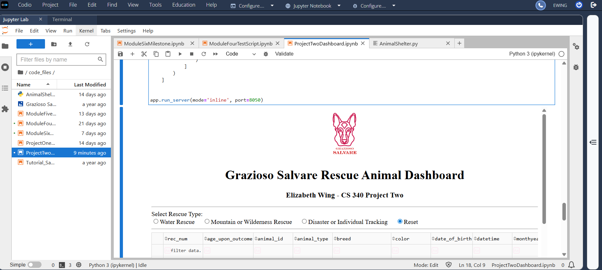
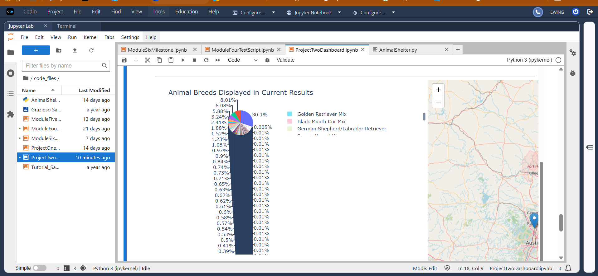
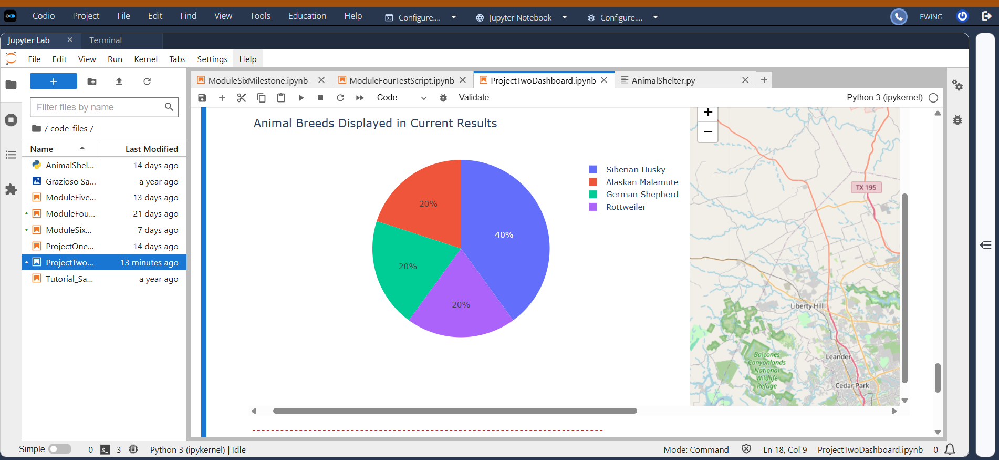

# Animal Shelter Management Dashboard

## Overview

The Animal Shelter Management Dashboard is a client/server application developed using Python, MongoDB, and Dash for CS340 – Client/Server Development at Southern New Hampshire University.

The application uses the Austin Animal Center Outcomes dataset and allows users to filter and visualize animal shelter records based on rescue-training criteria.

## Features

- MongoDB CRUD operations
- Searchable and sortable animal records
- Water Rescue filtering
- Mountain or Wilderness Rescue filtering
- Disaster or Individual Tracking filtering
- Interactive geographic map
- Dynamic breed pie chart
- Dashboard reset functionality

## Technologies

- Python
- MongoDB
- PyMongo
- Dash
- JupyterDash
- Plotly
- Dash Leaflet
- Pandas
- Jupyter Notebook

## Screenshots

### Dashboard Starting State

### Water Rescue Filter

### Disaster or Individual Tracking Filter

## Project Structure

`AnimalShelter.py` contains the MongoDB CRUD functionality for creating, reading, updating, and deleting animal records.

`AnimalShelterDashboard.ipynb` contains the dashboard interface, rescue filtering logic, data table, pie chart, and interactive map.

## Setup

The project requires Python, MongoDB, Jupyter Notebook, and the required Python libraries.

The application expects a MongoDB database named `aac` with an `animals` collection. MongoDB credentials are stored using the following environment variables:

`MONGODB_USERNAME`  
`MONGODB_PASSWORD`

The original project was developed and tested in the SNHU Codio environment using JupyterDash, so additional configuration may be required when running it in another environment.

## Challenges and Solutions

One challenge involved configuring the Dash application to run correctly within the Codio environment. This was resolved by using the appropriate JupyterDash configuration and verifying the MongoDB authentication settings.

Another challenge involved constructing MongoDB queries that correctly matched the breed, age, and sex requirements for each rescue category. The filtering logic was tested against the dataset to verify that the appropriate records were returned.

## What I Learned

This project strengthened my understanding of client/server development and database integration. I gained experience creating reusable CRUD operations with MongoDB and PyMongo, connecting database functionality to a Python application, constructing MongoDB queries, and presenting database results through interactive tables, charts, and geographic visualizations.

## Future Enhancements

- User authentication
- Additional search and filtering options
- REST API integration
- Additional visualizations
- Report export functionality
- Responsive dashboard design
- Expanded automated testing
